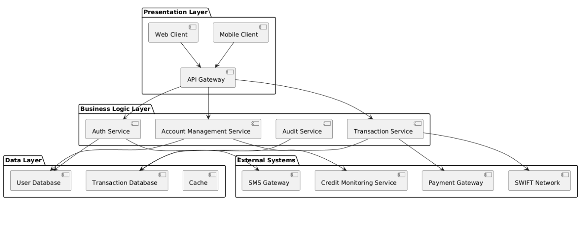
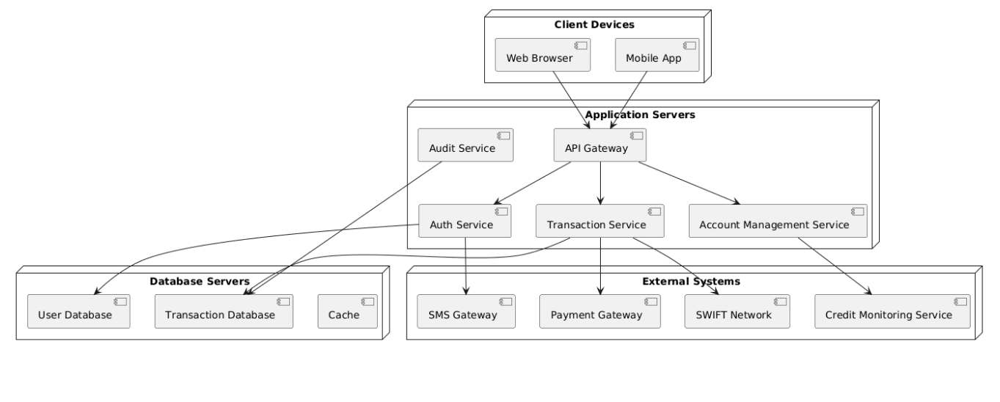

<h2>6. Архітектура системи та залежності між підсистемами</h2>

<h3>6.1. Загальні положення</h3>

Архітектура інформаційної системи онлайн-банкінгу визначає структурну організацію її компонентів та взаємозв’язки між ними. Основні цілі архітектури:

<ul>
    <li>Безпека фінансових операцій — забезпечення конфіденційності, цілісності та доступності даних.</li>
    <li>Висока надійність і доступність — збереження працездатності навіть при високих навантаженнях.</li>
    <li>Гнучкість і масштабованість — можливість легко додавати нові сервіси та користувацькі функції.</li>
    <li>Інтеграція із зовнішніми системами — забезпечення взаємодії з платіжними шлюзами, міжбанківськими мережами та сервісами кредитного моніторингу.</li>
</ul>

Архітектура розроблена за три-рівневою моделлю:

<ol>
    <li>Presentation Layer (рівень інтерфейсу користувача)</li>
    <li>Business Logic Layer (рівень бізнес-логіки)</li>
    <li>Data Layer (рівень даних)</li>
</ol>

Цей поділ забезпечує чітку модульність та ізоляцію компонентів, що підвищує безпеку, масштабованість і підтримку системи.

<h3>6.2. Логічна архітектура системи</h3>

<h4>6.2.1. Рівень Presentation (Інтерфейс користувача)</h4>

<ul>
    <li>Надання зручного та інтуїтивного інтерфейсу для клієнтів і співробітників банку.</li>
    <li>Забезпечення захищеної передачі даних через HTTPS.</li>
    <li>Валідація введених даних на стороні клієнта для попередження помилок і зловмисних дій.</li>
</ul>

Компоненти Presentation Layer:

<ul>
    <li>Web-клієнт: доступ через браузер для виконання основних операцій — перегляд балансу, переказ коштів, управління картками.</li>
    <li>Мобільний клієнт: адаптований для смартфонів і планшетів; підтримує push-повідомлення для сповіщень.</li>
    <li>API Gateway: центральний шлюз для маршрутизації запитів від клієнтів до сервісів бізнес-логіки; забезпечує аутентифікацію та контроль доступу.</li>
</ul>

<h4>6.2.2. Рівень Business Logic (Бізнес-логіка)</h4>

Компоненти Business Logic Layer:

<ul>
    <li>Auth Service (Сервіс автентифікації) — перевірка логіну/пароля, 2FA, контроль сесій.</li>
    <li>Transaction Service (Сервіс транзакцій) — виконання фінансових операцій, перевірка балансу та лімітів.</li>
    <li>Account Management Service — управління картками та рахунками, надання історії операцій.</li>
    <li>Audit Service — логування операцій користувачів та адміністраторів, формування звітів для аудиту.</li>
</ul>

<h4>6.2.3. Рівень Data (Збереження даних)</h4>

<ul>
    <li>User Database (PostgreSQL) — зберігання облікових записів, ролей та прав доступу.</li>
    <li>Transaction Database (PostgreSQL/MongoDB) — історія фінансових операцій, логи аудиту.</li>
    <li>Cache (Redis) — тимчасове зберігання часто запитуваних даних для підвищення швидкодії.</li>
</ul>

<h3>6.3. Зовнішні системи та інтеграція</h3>

<table>
<thead>
<tr>
<th>Зовнішня система</th>
<th>Призначення</th>
<th>Інтерфейс / Протокол</th>
</tr>
</thead>
<tbody>
<tr>
<td>Платіжний шлюз</td>
<td>Оплата комунальних та сторонніх послуг</td>
<td>REST API, HTTPS</td>
</tr>
<tr>
<td>SWIFT / міжбанківська мережа</td>
<td>Міжбанківські перекази</td>
<td>SOAP / REST API</td>
</tr>
<tr>
<td>SMS Gateway</td>
<td>Надсилання одноразових кодів 2FA</td>
<td>REST API / SMPP</td>
</tr>
<tr>
<td>Сервіс кредитного моніторингу</td>
<td>Перевірка кредитної історії та оцінка ризиків</td>
<td>REST API</td>
</tr>
</tbody>
</table>

<h3>6.4. Діаграма компонентів (Component Diagram)</h3>

<i>Рисунок 6.1 – Діаграма компонентів системи онлайн-банкінгу.</i>

<h3>6.5. Діаграма розміщення (Deployment Diagram)</h3>

<i>Рисунок 6.2 – Діаграма розміщення системи онлайн-банкінгу.</i>

<h3>6.6. Особливості та переваги архітектури</h3>

<ul>
    <li>Модульність: компоненти ізольовані, полегшує підтримку та тестування.</li>
    <li>Масштабованість: підтримка горизонтального та вертикального масштабування.</li>
    <li>Безпека: 2FA, шифрування даних, розмежування ролей.</li>
    <li>Надійність: реплікація баз даних, кешування, логування критичних операцій.</li>
    <li>Інтеграція: взаємодія із зовнішніми системами через стандартизовані API.</li>
</ul>

<h3>6.7. Висновок до розділу</h3>

Розроблена архітектура системи онлайн-банкінгу забезпечує безпечну та надійну роботу, можливість масштабування під навантаження, чітку інтеграцію із зовнішніми сервісами та модульність, що спрощує розвиток і підтримку системи.

Логічна і фізична моделі системи створюють основу для подальшої розробки та тестування, гарантують відповідність вимогам безпеки та забезпечують ефективну організацію роботи всіх підсистем. Використання діаграм компонентів та розміщення дозволяє наочно відобразити залежності між підсистемами, що полегшує аналіз, розробку та підтримку системи.

