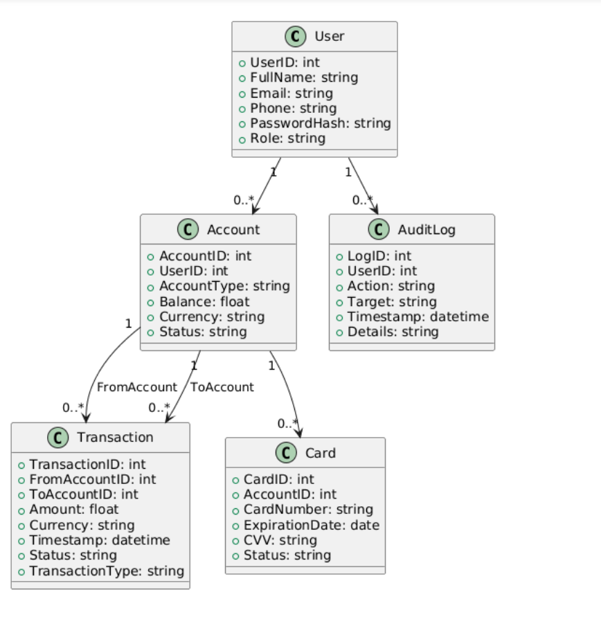
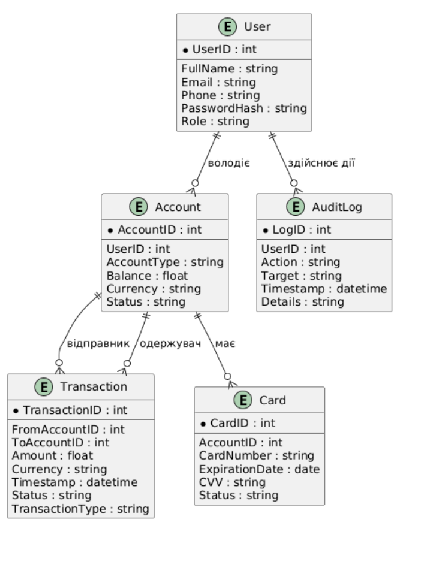

<h2>7. Побудова моделі даних</h2>

<h3>7.1. Загальні положення</h3>

Модель даних визначає структуру інформації, що зберігається та обробляється в системі онлайн-банкінгу, забезпечує узгодженість даних і їх відповідність бізнес-процесам.

Метою розробки моделі даних є:

<ul>
    <li>Визначити основні сутності системи та їх атрибути.</li>
    <li>Встановити зв’язки між сутностями для коректного зберігання інформації.</li>
    <li>Визначити ключі для унікальної ідентифікації записів та підтримки цілісності даних.</li>
    <li>Забезпечити відповідність між User Stories і структурою даних, що дозволяє реалізувати бізнес-процеси без конфліктів і дублювання інформації.</li>
</ul>

<h3>7.2. Основні сутності системи</h3>

<table>
<thead>
<tr>
<th>Сутність</th>
<th>Опис</th>
<th>Основні атрибути</th>
<th>Ключі</th>
</tr>
</thead>
<tbody>
<tr>
<td>User (Користувач)</td>
<td>Зареєстрований клієнт банку</td>
<td>UserID, FullName, Email, Phone, PasswordHash, Role</td>
<td>PK: UserID</td>
</tr>
<tr>
<td>Account (Рахунок)</td>
<td>Банківський рахунок клієнта</td>
<td>AccountID, UserID, AccountType, Balance, Currency, Status</td>
<td>PK: AccountID, FK: UserID → User.UserID</td>
</tr>
<tr>
<td>Transaction (Транзакція)</td>
<td>Фінансова операція між рахунками</td>
<td>TransactionID, FromAccountID, ToAccountID, Amount, Currency, Timestamp, Status, TransactionType</td>
<td>PK: TransactionID, FK: FromAccountID → Account.AccountID, FK: ToAccountID → Account.AccountID</td>
</tr>
<tr>
<td>Card (Банківська картка)</td>
<td>Платіжна картка клієнта</td>
<td>CardID, AccountID, CardNumber, ExpirationDate, CVV, Status</td>
<td>PK: CardID, FK: AccountID → Account.AccountID</td>
</tr>
<tr>
<td>AuditLog (Журнал подій)</td>
<td>Логування дій користувачів</td>
<td>LogID, UserID, Action, Target, Timestamp, Details</td>
<td>PK: LogID, FK: UserID → User.UserID</td>
</tr>
</tbody>
</table>

<h3>7.3. Визначення зв’язків між сутностями</h3>

<ul>
    <li><strong>User → Account</strong>: один користувач може мати кілька рахунків (1:N).</li>
    <li><strong>Account → Transaction</strong>: один рахунок може брати участь у багатьох транзакціях як відправник або одержувач (1:N).</li>
    <li><strong>Account → Card</strong>: один рахунок може бути прив’язаний до кількох карток (1:N).</li>
    <li><strong>User → AuditLog</strong>: користувач може здійснювати багато дій, кожна з яких записується в журнал (1:N).</li>
</ul>

Ці зв’язки дозволяють забезпечити відстеження всіх фінансових операцій, управління рахунками і картками, а також контроль дій користувачів у системі.

<h3>7.4. UML-діаграма класів (Class Diagram)</h3>

<i>Рисунок 7.1 – UML-діаграма класів системи онлайн-банкінгу.</i>

<h3>7.5. ER-діаграма (Entity-Relationship Diagram)</h3>

<i>Рисунок 7.2 – ER-діаграма логічної моделі бази даних системи.</i>

<h3>7.6. Відповідність моделі даних бізнес-процесам</h3>

<ul>
    <li>User → Account → Transaction: реалізація сценаріїв переказу коштів, оплати комунальних послуг та історії операцій.</li>
    <li>Account → Card: функціонал керування платіжними картками, включаючи блокування/розблокування та зміну лімітів.</li>
    <li>User → AuditLog: логування дій користувачів для безпеки та аудиту системи.</li>
</ul>

Таким чином, модель даних відображає всі ключові бізнес-процеси, підтримує цілісність та узгодженість інформації в системі онлайн-банкінгу.

<h3>7.7. Висновок до розділу</h3>

Розроблена модель даних забезпечує:

<ul>
    <li>узгодженість і цілісність фінансових даних;</li>
    <li>повне відображення взаємодії користувачів із системою;</li>
    <li>гнучкість для подальшого розвитку системи (додавання нових сутностей, сервісів, звітів);</li>
    <li>інтеграцію з бізнес-процесами та сценаріями використання.</li>
</ul>

ER- та UML-діаграми є основою для реалізації бази даних і подальшої розробки сервісів системи.

